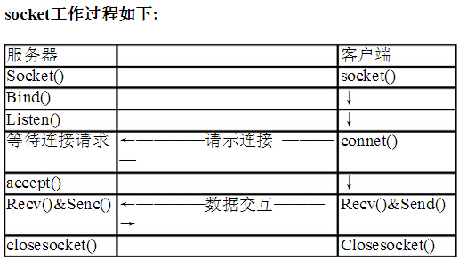

## TCP建立连接？

### 意图

主要用于交换两个信息：

- 初始序列号 ISN（Initial Sequence Number）
- 交换 TCP 通讯参数（如 MSS、窗口比例因子、选择性确认、指定校验和算法）

#### 为什么ISN两端不一样且不能从0开始？ 

不能从0开始的原因是为了解决网络传输中报文延时、丢失后重发时不会对两端造成影响，所以使用唯一性标识的随机数作为ISN。

#### 为什么是三次握手？

- 基于交换两端SYN 和 通讯参数（两次）
- 基于可靠传输，一个请求必须回复一个ACK表示我收到报文 （两次基础上至少三次）

### 过程

首先发送端会发送一个SYN报文，如下所示：

当接收端能收到次SYN报文后，会回传一个填写自己信息后的SYN报文，并且将确认消息ACK一并回传给发送端。

最后发送端以一个确认消息ACK结束此次握手过程

#### 为什么 SYN 段不携带数据却要消耗一个序列号呢？

不占用序列号的段是不需要确认的（都没有内容确认个啥），比如 ACK 段。SYN 段需要对方的确认，需要占用一个序列号。

### 状态变迁

会根据当前报文发送情况、接收情况分别进入如下图所示的状态。需要额外注意的是，通过状态变更了解SYN攻击的缘由。

### SYN攻击

攻击者短时间伪造不同 IP 地址的 SYN 报文，快速占满 backlog 队列，使 服务器不能为正常用户服务

#### 方案1：调整缓存队列，以及超出处理能力时的应对方案

#### 方案2：tcp_syncookies

正常TCP请求时的流程，以及例如Nginx网络处理服务器加载消息变慢时会导致Accept Queue队列阻塞：

当遇到 SYN 攻击后，SYN队列很快就会被冲满，新的 SYN 不进入队列，计算出 cookie 再 以 SYN+ACK 中的序列号返回客户端，正常客户端发报文时， 服务器根据报文中携带的 cookie 重新恢复连接。 

> 不过需要注意由于 cookie 占用序列号空间，导致此时所有 TCP 可选 功能失效，例如扩充窗口、时间戳等

### 握手优化

#### 缓冲队列

#### FTO

### 细节点：TCP_DEFER_ACCEPT

###socket工作状态
